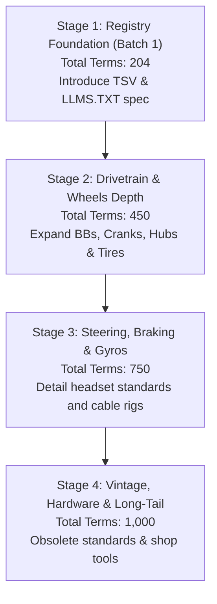

# BMX Parts Depot: A-Z Dictionary Expansion Blueprint

This document outlines the strategic roadmap and design principles for expanding the BMX Parts Depot A-Z parts glossary from its current 104 terms to a comprehensive registry of up to 1,000 high-value technical terms.

---

## 1. Critical Evaluation of Previous Proposals (Claude's Blueprint)

Before embarking on this content expansion, we must critically evaluate the architecture proposed in the previous analysis (Claude's blueprint). While that proposal correctly identified the potential weight constraints of scaling to 1,000 terms, its structural recommendations introduced serious usability and branding problems:

### Critique 1: The Fragmentation of Search (The "Letter Pages" Pitfall)
* **Claude's Proposal:** Split the glossary into 26 individual letter pages (e.g., `/guides/glossary/a/`) and introduce a multi-tiered page architecture to reduce initial page weights.
* **Our Critique:** This completely breaks the primary user experience of the site. In [`assets/guide.js`](file:///Users/joe/Documents/bmxpartsdepot.com/assets/guide.js), the search functionality relies on a client-side filter over the DOM (`#az-results`). If terms are split across 26 pages, client-side search is destroyed unless we load a heavy external JSON search index, requiring complex JavaScript routing. A single, clean page containing 1,000 terms is projected to be ~1MB in HTML size. In modern web performance, 1MB of pure, highly compressable text is negligible (often compressed to <150KB over the wire via Gzip/Brotli) and renders instantly. Keeping the glossary on a single page ensures that instant, zero-dependency client-side filtering works perfectly without JS framework overhead.

### Critique 2: Breaking the "Ten Master Guides" Branding
* **Claude's Proposal:** Add a new "Pillar 11: Threads, Fasteners and Shop Tools" to house the Hardware category.
* **Our Critique:** The brand layout, CSS, sitemap, and home screen grid are strictly optimized around **The Ten Master Guides**. Introducing an eleventh pillar disrupts the page balance and requires redesigning home screen card layouts. Hardware, fasteners, and tools are not standalone "buying guides"; they are supporting utilities. The correct approach is to keep the 10-pillar structure and distribute hardware/tool entries as sub-sections within the relevant master guides (e.g., bottom bracket presses belong in the BB guide; chain breakers belong in the Drivetrain guide; thin cone wrenches belong in the Wheels guide).

### Critique 3: Deviating from the Strict 8-Category Taxonomy
* **Claude's Proposal:** Propose a 9th category: "Bottom Brackets, Cranks & Pedals" to resolve mapping friction.
* **Our Critique:** The user requested a strict 8-category taxonomy. Deviating to a 9th category creates unnecessary structural bloat. Bottom brackets and cranks are critical links in transferring power from rider to wheel; in mechanical engineering, they are standard components of the **Drivetrain**. Pedals and handlebars, being user-contact points, map directly to the **Cockpit & Seating** or **Drivetrain**. We can enforce strict compliance with the 8 categories while retaining clear technical descriptions.

### Critique 4: The Tire & Tube Exclusion Mistake
* **Claude's Proposal:** Question or exclude tires and tubes as "soft goods" out of scope for a site focused on hard parts.
* **Our Critique:** Tire width clearance, tire bead types (Kevlar vs. wire), tube valve types (Schrader vs. Presta), and ISO bead seat diameters are among the most common fitment traps for BMX buyers. A used 20" wheelset is useless if the buyer's frame chainstays cannot clear a modern 2.40" tire, or if they buy a 20" fractional tire (ISO 451) for a standard 20" freestyle rim (ISO 406). Excluding tires and tubes leaves a massive coverage gap. They belong under **Wheels, Hubs & Axles**.

---

## 2. Taxonomy Map: The 8 Strict Categories

We map all dictionary terms (current and planned) to the 8 strict categories specified in the requirements. 

| # | Category Name | Scope & Inclusions | Target Terms | Pillar Alignment |
|---|---|---|---|---|
| 1 | **Drivetrain & Gearing** | Chains, sprockets, cassette drivers, freecoaster clutches, slack adjusters, gear ratio math, bottom brackets (Mid, Spanish, American, Euro), spindles (19mm, 22mm, 24mm), cranks (1-piece, 2-piece, 3-piece), and spline systems. | 180 | Pillars 01, 04, 05 |
| 2 | **Frame Geometry & Construction** | Top tube lengths, headtube angles, chainstay length, standover, bottom bracket height, wishbone stays, looptails, tubing types (chromoly vs. hi-ten), butting, TIG welds, brazing, dropouts, serial number location, and brake posts. | 150 | Pillar 02 |
| 3 | **Wheels, Hubs & Axles** | Axle diameters (14mm, 3/8", 10mm), hub types (cassette, freecoaster, freewheel), driver pawls, hub spacing (O.L.D.), spokes (butted, J-bend, gauges), rim walls (single, double, triple), bead seat diameter (ISO 406/451), tire clearance, and hub guards. | 180 | Pillar 03 |
| 4 | **Steering & Front End** | Headset standards (integrated, pressed, zero-stack, threaded), steerers, compression bolts, crown races, fork offset (rake), front-load vs. top-load stems, stem reach, bar clamp knurling, fork dropouts, and stack height. | 130 | Pillar 07 |
| 5 | **Braking Systems & Detanglers** | U-brakes, V-brakes, caliper brakes, 990 mounts, yokes, y-cables, detangler bearing units, gyro tabs (welded vs. removable), upper/lower gyro cables, London Mods, brake levers, spring tension adjusters, and pads (clear vs. black). | 110 | Pillar 06 |
| 6 | **Seating & Cockpit** | Seats (Pivotal, Stealth, Tripod, Railed, Combos), seatposts, seatpost clamp diameters (28.6mm, 25.4mm), seat tube angles, handlebars (2-piece vs. 4-piece, rise, width, sweeps), grips (flanged vs. flangeless), and bar end plugs. | 110 | Pillars 08, 09 |
| 7 | **Vintage & Era Identification** | Old-school vs. mid-school features, Ashtabula cranks, threaded stems/stems wedges, coaster brakes, mag wheels (Tuff Wheels), looptails, web gussets, obsolete thread pitches, and chrome plating types. | 120 | Pillar 10 |
| 8 | **Hardware, Fasteners & Tools** | Spoke wrenches, bottom bracket presses, chain breakers, peg sockets, thread pitches (M14x1.0, 3/8"-26 TPI), torque specs, spindle bolts, pinch bolts, chain tensioner screws, and thin cone wrenches. | 120 | All Pillars (Shared) |

---

## 3. Filtering & Quality Control Rules

To prevent the dictionary from becoming bloated with generic or low-value information as it scales to 1,000 terms, every entry must pass the following strict filter rules:

### INCLUDE Rules
* **True BMX Fitment Standards:** Must detail a physical measurement, diameter, spline count, thread pitch, or spacing standard (e.g., `M24 x 1.5 thread`, `48-spline drive`, `110mm hub spacing`).
* **Mechanical Tolerances and Measurements:** Must define a performance metric that is measurable in a shop (e.g., `rim runout`, `spoke tension`, `chain elongation`).
* **Component Sub-Parts:** Tiny pieces that wear out, are lost, or are sold separately (e.g., `gyro tabs`, `driver pawl springs`, `sprocket hat washers`, `spacers`).
* **Historical Era Terminology:** Defunct standards that a buyer will meet on the vintage or used market (e.g., `Ashtabula spindle`, `quill stem wedge`, `JIS 27.0mm crown race`).
* **Shop Fitment Jargon:** Slang terms that describe fitment constraints (e.g., `slammed` seating, `micro-drive`, `hub guard spacing`).

### EXCLUDE Rules
* **Generic Cycling Terms:** Do not include words like *derailleur*, *pannier rack*, *quick-release skewer*, or *water bottle cage* that are not used in BMX freestyle or classic street/dirt setups.
* **Aerial and Trick Names:** Words like *X-up*, *tailwhip*, *barspin*, or *360* are banned. While a trick name might be mentioned inside a definition to explain why a part (like a detangler) exists, it can never have its own term entry.
* **Marketing Buzzwords:** Terms like *aircraft-grade*, *bulletproof*, *street-ready*, or *pro-level* are excluded. Focus strictly on material designations (e.g., `4130 chromoly`, `6061-T6 aluminum`).

### The One-Sentence Fitment Test
> [!IMPORTANT]
> Every term must answer this question: **"What does a buyer do differently because they know this term and its specifications?"**
> If the answer is "nothing, it is just interesting," the term is trivia and is excluded from the glossary.

---

## 4. Scaling Roadmap to 1,000 Terms

To scale the content without introducing rendering lag or structural bloat, we will roll out in a structured, multi-phase plan:

### Stage 1: Registry Foundation (Batch 1 - Current Phase)
* **Goal:** Increase the term registry to 204 terms.
* **Implementation:** Draft 100 new terms (Batch 1).
* **Technical Work:** 
  1. Maintain the single-page glossary index on `guides/index.html` to keep client-side instant search active.
  2. Implement the `llmstxt.org` specification for `llms.txt`.
  3. Ensure zero warning/collision errors in the build.

### Stage 2: Drivetrain & Wheels Depth (Terms 205–450)
* **Goal:** Fully flesh out the most critical fitment zones (bottom brackets, crank axles, spokes, and tire sizes).
* **Technical Work:** 
  * Automate the cross-linking: write an auto-linker in `build.py` that scans compiled guide HTML and automatically links the first mention of a term to its glossary anchor.

### Stage 3: Steering, Braking & Gyros (Terms 451–750)
* **Goal:** Standardize front-end headtube configurations and complex gyro cable routing terms.
* **Technical Work:** Optimize JSON-LD schema payload. If the inlined schema on `guides/index.html` grows beyond 150KB, split the DefinedTermSet from the main page graph and host it as a standalone static JSON-LD file (`/guides/schema-terms.json`) referenced in the header.

### Stage 4: Vintage, Hardware & Long-Tail (Terms 751–1,000)
* **Goal:** Populate the long-tail historical terminology and obscure hardware standards.
* **Technical Work:** Implement a dense alphabetical quick-jump list at the foot of each pillar guide to make index crawling seamless for search engines and AI models.
